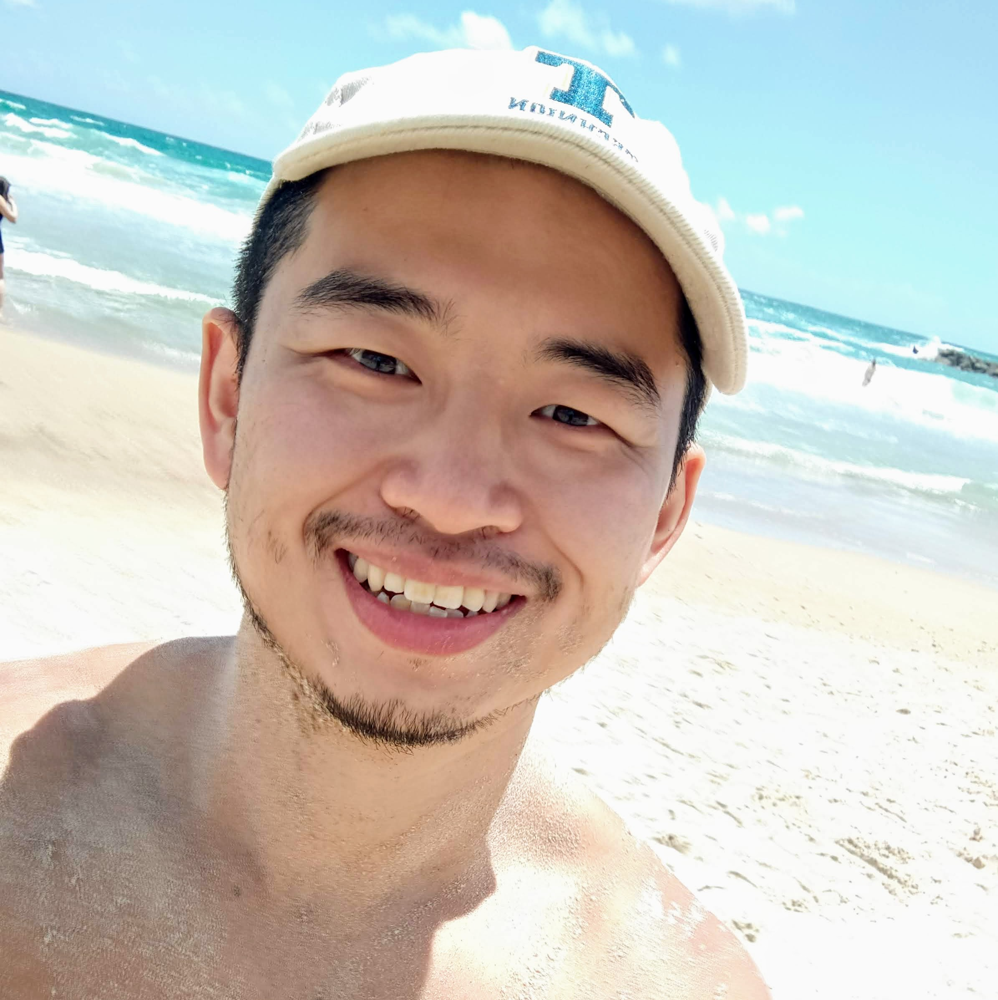

# Zhenyao Sun's Home Page

- I am an Assitant Professor at [School of Mathmatics and Statistics at Beijing Institute of Technology](https://math.bit.edu.cn/)
- Before, I was a Postdoc student of [Faculty of Data and Decision Sciences at the Technion - Israel Institute of Technology](https://dds.technion.ac.il/) hosted by [Prof. Leonid Mytnik](https://web.iem.technion.ac.il/site/academicstaff/leonid-mytnik/). 
- I got my Ph.D. at the [School of Mathematical Sciences at Peking University](https://www.math.pku.edu.cn/puremath_en/) under the supervision of [Prof. Yan-Xia Ren](http://www.math.pku.edu.cn/teachers/renyx/indexE.htm). 
- I also visited [Prof. Renming Song](https://faculty.math.illinois.edu/~rsong/) as a joint Ph.D. student at [Mathematics at the University of Illinois at Urbana-Champaign](https://math.illinois.edu/). 
- I got my B.S. at the School of Mathematical Sciences at Peking University. 
- My research interest is probability theory, with a focus on models related to branching processes. 
- Email: zhenyao dot sun at gmail dot com
- Office: 411B Wen-Cui building E, Beijing Institute of Technology Liangxiang, Beijing. 

## Preprints
1. [C. Barnes, L. Mytnik, and Z. Sun, *Wright-Fisher stochastic heat equations with irregular drifts.*](Files/Papers/paper11.pdf)
1. [L. Qian, and Z. Sun, *On the spetral radius of of the $(L,\kappa)$-lazy Markov chain.*](Files/Papers/paper10.pdf)
1. [C. Barnes, L. Mytnik, and Z. Sun, *Effect of small noise on the speed of reaction-diffusion equations with non-Lipschitz drift.* To appear in Ann. Inst. Henri Poincaré Probab. Stat.](Files/Papers/paper8.pdf)

## Publications

1. [C. Barnes, L. Mytnik, and Z. Sun, *On the coming down from infinity of coalescing Brownian motions.* Ann. Probab. **52** (2024), no. 1, 67-92](Files/Papers/paper9.pdf)
1. [R. Liu, Y.-X. Ren, R. Song, and Z. Sun, *Subcritical superprocesses conditioned on non-extinction.* Stochastic Process. Appl. **163** (2023), 498-534.](Files/Papers/SPA2023.pdf)
1. [Y.-X. Ren, R. Song, Z. Sun and J. Zhao: *Stable Central Limit Theorems for Super Ornstein-Uhlenbeck Processes, II.* Acta Math. Sin. (Engl. Ser.) **38** (2022), no. 3, 487-498.](Files/Papers/paper5.pdf) 
1. [R. Liu, Y.-X. Ren, R. Song and Z. Sun: *Quasi-stationary distributions for subcritical superprocesses.* Stochastic Process. Appl. **132** (2021), 108-134.](Files/Papers/paper4.pdf) 
1. [Y.-X. Ren, R. Song and Z. Sun: *Limit theorems for a class of critical superprocesses with stable branching.* Stochastic Process. Appl. **130** (2020), no. 7, 4358-4391.](Files/Papers/paper3.pdf) 
   - There is a mistake when we cite H. Kesten, P. Ney and F. Spitzer’s 1966 paper: we can not obtain (1.2) when $\sigma = \infty$. This does not affect the other part of the paper. 
1. [Y.-X. Ren, R. Song, Z. Sun, and J. Zhao: *Stable central limit theorems for super Ornstein-Uhlenbeck processes*. Electron. J. Probab. **24** (2019), Paper no. 141, 42 pp.](Files/Papers/paper6.pdf) 
1. [Y.-X. Ren, R. Song and Z. Sun: *Spine decompositions and limit theorems for a class of critical superprocesses.* Acta. Appl. Math. **165** (2020), 91-131.](Files/Papers/paper2.pdf) 
1. [Y.-X. Ren, R. Song and Z. Sun: *A 2-spine decomposition of the critical Galton-Waston tree and a probabilistic proof of Yaglom's theorem.* Electron. Commun. Probab. **23** (2018), Paper no. 42, 12 pp.](Files/Papers/paper1.pdf)
1. [T. Hu and Z. Sun: *Purchase limit policy and social welfare: A theoretical exploration.*  Economic Science. **6** (2011), 42-50, in Chinese.](Files/Papers/paper0.pdf)

## Slides

- [Wright-Fisher stochastic heat equations with irregular drifts](Files/Irregular.pdf)
- [Subcritical superprocesses conditioned on non-extinction](Files/Qprocess.pdf)
- [On the coming down from infinity of coalescing Brownian motions](Files/ComingDown.pdf)
- [Effect of small noise on the speed of  reaction-diffusion equation with non-Lipschitz drift](Files/WaveSpeed.pdf)
- [Quasi-stationary distributions for subcritical superprocesses](Files/subyaglom_talk.pdf)
- [Stable Central Limit Theorems for Super Ornstein-Uhlenbeck Processes](Files/Zhenyao2020Oct.pdf)
- [Limit theorems for a class of critical superprocesses with stable branching](Files/2018JSNU.pdf) 
- [Spine decompositions and limit theorems for a class of critical superprocesses](Files/RenSongSun2018Spine.pdf)

## Events

- 2024 Nov. 7-10, Xiamen, 第十三届全国概率统计会议
- 2024 Nov. 11-15, Shenzhen, The 10th Workshop on Branching Processes and Related Topics
- [2024 Dec. 16-20, Abu Dhubi, The 14th AIMS conference](https://www.aimsconference.org/conferences/2024/index.html)
- 2025 Sept. 8-12, Bucharest,12th international conference on stochastic analysis and its applications

## Teachings

* 2024 Fall, Topics in Probability theory, Beijing Institute of Technology 
  * 上课时间地点：周一和周三 15:15--17:40 文萃楼 F202
  * 答疑时间地点：周二 14:00--17:00 文萃楼 E411
  * [教学大纲.doc](Classes/概率论选讲教学大纲.doc) (含考核标准)
  * [教学日历.doc](Classes/概率论选讲教学日历.doc) (含具体上课、答疑日期和学术报告提交截止日期)
  * [1_Measure_Theory.pdf](Classes/1_Measure_Theory.pdf) and [Two envelopes problem](https://en.wikipedia.org/wiki/Two_envelopes_problem)
  * [2_Independence.pdf](Classes/2_Independence.pdf) and [Why does the Cauchy distribution have no mean?](https://stats.stackexchange.com/questions/36027/why-does-the-cauchy-distribution-have-no-mean)
  
* 2023 Fall, Topics in Probability theory, Beijing Institute of Technology

## Links

- I am maintaining [the bilibili channel](https://space.bilibili.com/151014650) for [the One World Probability Seminar](https://www.owprobability.org)
- I was one of the organizers of the [Technion probability seminar](https://probability.technion.ac.il/seminar/) jointly with [Maximilian Fels](https://sites.google.com/view/maximilianfels/home) in 2022
- My [Phd Thesis](Files/thesis.pdf)
- I was the teaching assistant of class [*Stochastic processes*](http://www.math.pku.edu.cn/teachers/dayue/Homepage/instruction.htm) at Peking University, spring 2019. Here are my [Solutions to the homeworks](Files/HW.html)
- I was the organizer of the [Welcome Workshop for New Students in Probability Group, Peking University, Sept. 2018.](Files/Prob_Welcome_Seminar.html)