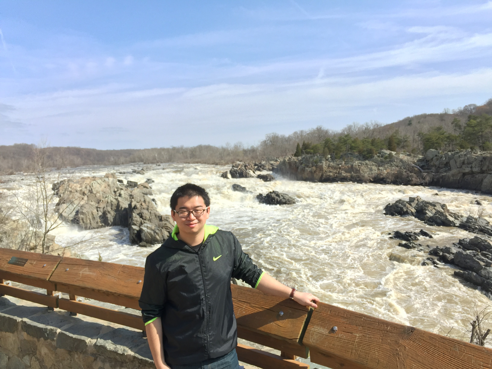

# Zhenyao Sun's Home Page

I am a Postdoc student of [The Faculty of Industrial Engineering and Management at the Technion - Israel Institute of Technology](https://web.iem.technion.ac.il/en/programs/undergraduate/industrial-engineering-and-management/about.html) hosted by [Prof. Leonid Mytnik](https://web.iem.technion.ac.il/en/people/userprofile/leonidm.html). Before, I got my Ph.D. at the [School of Mathematical Sciences at Peking University](http://www.math.pku.edu.cn/en) under the supervision of [Prof. Yan-Xia Ren](http://www.math.pku.edu.cn/teachers/renyx/indexE.htm). I also visited [Prof. Renming Song](https://faculty.math.illinois.edu/~rsong/) as a joint Ph.D. student at [Mathematics at the University of Illinois at Urbana-Champaign](https://math.illinois.edu/). I got my B.S. at the [School of Mathematical Sciences at Peking University.](http://www.math.pku.edu.cn/en) My research interest is probability theory, with a focus on models related to population dynamics. 

Email: zhenyao.sun@gmail.com

Office: 411 Cooper Building, Haifa, Isreal.

- My [Phd Thesis](https://someonedomath.github.io/MyPkuPhdThesis/doc/example/thesis.pdf)

- I am the teaching assistant of class [*Stochastic processes*](http://www.math.pku.edu.cn/teachers/dayue/Homepage/instruction.htm) at Peking University, spring 2019. Here are my [Solutions to the homeworks](Files/HW.html).
- I am one of the organizer of [Probability Welcome Seminar, Peking University, September, 2018](Files/Prob_Welcome_Seminar.html)

## Preprints

1. [Y.-X. Ren, R. Song and Z. Sun: *Limit theorems for a class of critical superprocesses with stable branching.*](https://arxiv.org/pdf/1807.02837.pdf)

## Publications

1. [Y.-X. Ren, R. Song, Z. Sun, and J. Zhao: *Stable central limit theorems for super Ornstein-Uhlenbeck processes*. Electron. J. Probab. Volume 24 (2019), paper no. 141, 42 pp.](https://projecteuclid.org/euclid.ejp/1576638110) 

1. [Y.-X. Ren, R. Song and Z. Sun: *Spine decompositions and limit theorems for a class of critical superprocesses.* Acta Appl Math (2019). https://doi.org/10.1007/s10440-019-00243-7](https://arxiv.org/pdf/1711.09188.pdf)
2. [Y.-X. Ren, R. Song and Z. Sun: *A 2-spine decomposition of the critical Galton-Waston tree and a probabilistic proof of Yaglom's theorem.* Electron. Commun. Probab. **23** (2018), Paper No. 42, 12 pp. ](https://arxiv.org/pdf/1706.07125.pdf)
3. [T. Hu and Z. Sun: *Purchase limit policy and social welfare: A theoretical exploration.*  Economic Science. 2011(6): 42-49. (In Chinese)](Files/胡2011限购.pdf)

## Talks

- [Stable Central Limit Theorems for Super Ornstein-Uhlenbeck Processes](StableSuperCLT/representation/representation.pdf)
  - Workshop on non-local operators and related topics, Peking University, Aug. 2019.
  - The 6th International Conference on Random Dynamical Systems, Shanghai Normal University, Jul. 2019.
  - Probability Seminar, Beijing Normal University, Apr. 2019.
- [Limit theorems for a class of critical superprocesses with stable branching](Files/2018JSNU.pdf) 
  - Beijing-Tianjin-Hebei Youth Probability Statistics Symposium, University of International Business and Economics, June, 2019.
  - The 2nd Conference on Probability and Statistics for Chinese Young Scholars. Jiangsu Normal University, Oct. 2018.
  - Probability Seminar. Beijing Jiaotong University, Sept. 2018.
  - Probability Welcome Seminar, Peking University, Sept. 2018.
- [Spine decompositions and limit theorems for a class of critical superprocesses.](Files/RenSongSun2018Spine.pdf)
  - Probability Seminar. Wuhan University, Mar. 2019.
  - Academic luncheon. Peking University, Nov. 2018.
  - Probability Seminar. Jiangsu Normal University, Jul. 2018.
  - The 4th Workshop on Branching Processes and Related Topics. East China Normal University. May, 2018.
  - Probability Seminar, University of Illinois at Urbana-Champaign, Nov. 2017.

<!-- Go to www.addthis.com/dashboard to customize your tools -->  